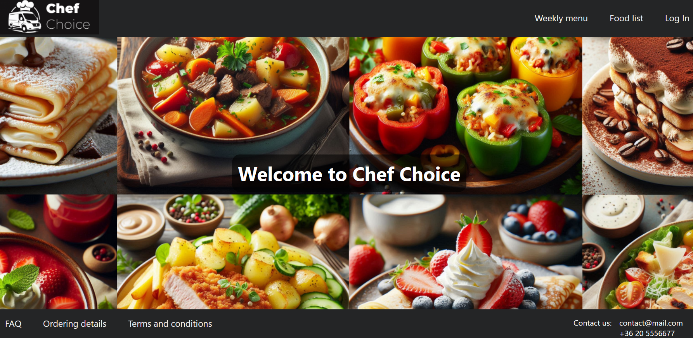
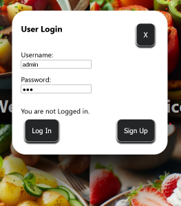
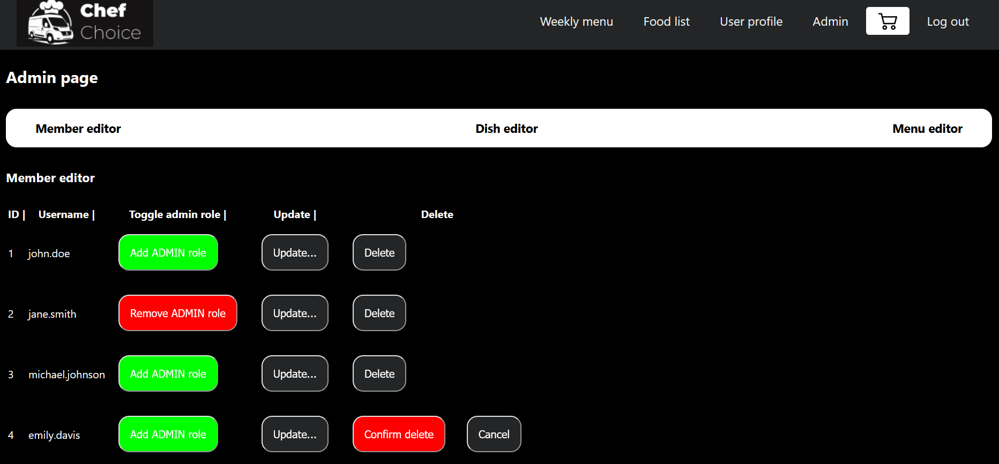

<a id="readme-top"></a>

# Chef Choice - a classic weekly menu ordering app

## What is Chef Choice?

Chef Choice is a classic prepared meal delivery service, where clients can choose and order their lunch and have them delivered to their home. 



<!-- TABLE OF CONTENTS -->
<details>
  <summary>Table of Contents</summary>
  <ol>
    <li><a href="#main-features">Main features</a></li>
    <li><a href="#technologies">Technologies</a></li>
    <li><a href="#developers">Developers</a></li>
    <li>
      <a href="#how-to-run-this-app">How to run this app?</a>
      <ul>
        <li><a href="#prerequisites">Prerequisites</a></li>
        <li><a href="#installation">Installation</a></li>
      </ul>
    </li>
    <li><a href="#how-to-use">How to use?</a></li>
    <li><a href="#acknowledgments">Acknowledgments</a></li>
  </ol>
</details>

## Main features

- Weekly menu view
- Selecting and ordering dishes
- Security and user management
- Admin page for editing content
- Review orders (TODO)
- Filtering function (TODO)
- Favorite dish and dish rating (TODO)

<p align="right">(<a href="#readme-top">back to top</a>)</p>

[//]: # (TODO - Add screenshot of weekly menu page)

## Technologies
- [![React]][React-url] [![Vite]][Vite-url] [![JavaScript]][JavaScript-url]
- [![CSS]][CSS-url]
- [![Spring-Boot]][Spring-Boot-url] [![Java]][Java-url]
- [![Postgres]][Postgres-url]
- [![Git]][Git-url] [![Docker]][Docker-url]
- [![Figma]][Figma-url]

<p align="right">(<a href="#readme-top">back to top</a>)</p>

## Developers
- [Kriszta Antal](https://github.com/KrisztaAntal)
- [Levente Fülöp](https://github.com/fulopl)
- [Péter Zsigri](https://github.com/ZsigriPeter)

<p align="right">(<a href="#readme-top">back to top</a>)</p>

## How to run this app?
### Prerequisites

- Download Docker Desktop

### Installation
1. Clone the repo
   ```sh
   git clone https://github.com/CodecoolGlobal/el-proyecte-grande-sprint-1-java-fulopl.git
   ```
2. Generate a JWT secret: a-32-character-ultra-secure-and-ultra-long-secret
3. Set up environment variables like in the ```.env.example```
4. Open Docker Desktop
5. Open a Terminal, then step into the projects directory (use ```cd directory_name``` to step into directory and ```cd ..```to step backwards)
6. Write ```docker compose up --build``` in terminal
7. After the build has finished, open <a href="http://localhost:5173/">http://localhost:5173/</a> in browser

<p align="right">(<a href="#readme-top">back to top</a>)</p>
   
[//]: # (TODO - Check correctness of text below)
## How to use?  
- You can log in with the test users created in advance:
  - User with basic user rights:
    - username: john.doe
    - password: 123
  - User with admin rights:
    - username: admin
    - password: 123



<p align="right">(<a href="#readme-top">back to top</a>)</p>

- After logging in you can use all the basic features of the application (selecting and ordering meals, check detailed information, check previous orders). 
- With admin rights, you can also use the features under the "Admin" tab, where you will be able to edit different types of content of the website.




<p align="right">(<a href="#readme-top">back to top</a>)</p>

## Acknowledgments
<p>The badges for the "Technologies" section are from <a href="https://github.com/inttter/md-badges?tab=readme-ov-file#-idecode-editors">here.</a></p>


[Postgres]: https://img.shields.io/badge/Postgres-%23316192.svg?logo=postgresql&logoColor=white
[Postgres-url]: https://www.postgresql.org/

[Figma]: https://img.shields.io/badge/Figma-F24E1E?logo=figma&logoColor=white
[Figma-url]: https://www.figma.com/

[Docker]: https://img.shields.io/badge/Docker-2496ED?logo=docker&logoColor=fff
[Docker-url]: https://www.docker.com/

[React]: https://img.shields.io/badge/React-%2320232a.svg?logo=react&logoColor=%2361DAFB
[React-url]: https://react.dev/

[Spring-Boot]: https://img.shields.io/badge/Spring%20Boot-6DB33F?logo=springboot&logoColor=fff
[Spring-Boot-url]: https://spring.io/projects/spring-boot

[Vite]: https://img.shields.io/badge/Vite-646CFF?logo=vite&logoColor=fff
[Vite-url]: https://vite.dev/guide/

[IntelliJ-IDEA]: https://img.shields.io/badge/IntelliJIDEA-000000.svg?logo=intellij-idea&logoColor=white
[IntelliJ-IDEA-url]: https://www.jetbrains.com/idea/

[CSS]: https://img.shields.io/badge/CSS-1572B6?logo=css3&logoColor=fff
[CSS-url]: https://en.wikipedia.org/wiki/CSS

[JavaScript]: https://img.shields.io/badge/JavaScript-F7DF1E?logo=javascript&logoColor=000
[JavaScript-url]: https://en.wikipedia.org/wiki/JavaScript

[Java]: https://img.shields.io/badge/Java-%23ED8B00.svg?logo=openjdk&logoColor=white
[Java-url]: https://www.java.com/en/

[Git]: https://img.shields.io/badge/Git-F05032?logo=git&logoColor=fff
[Git-url]: https://git-scm.com/
